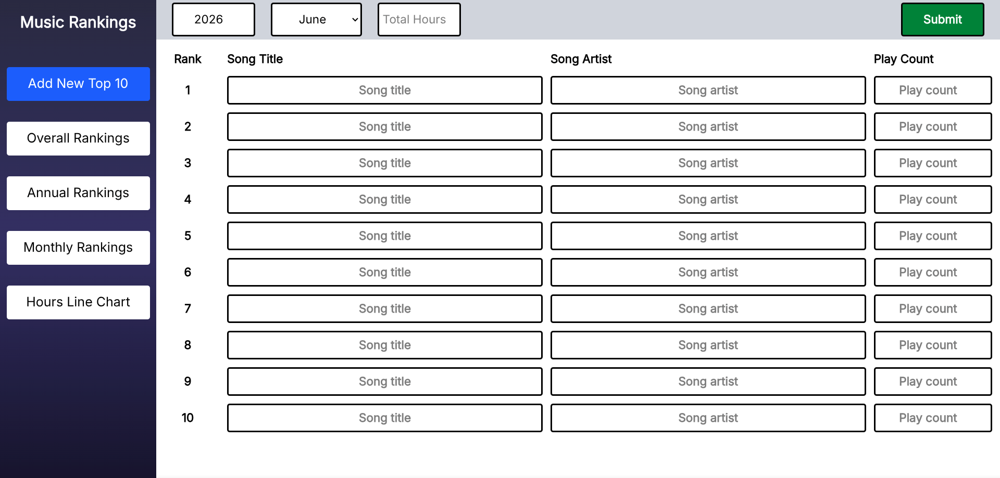
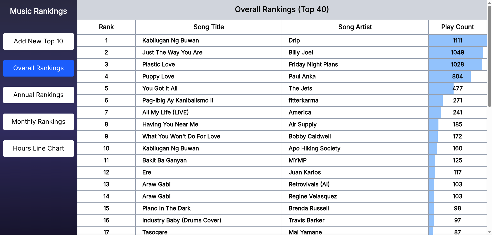
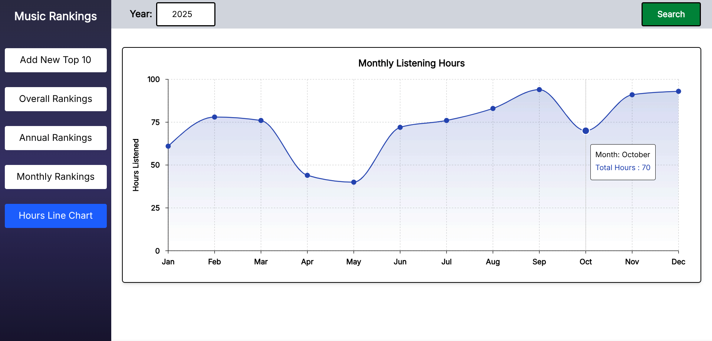
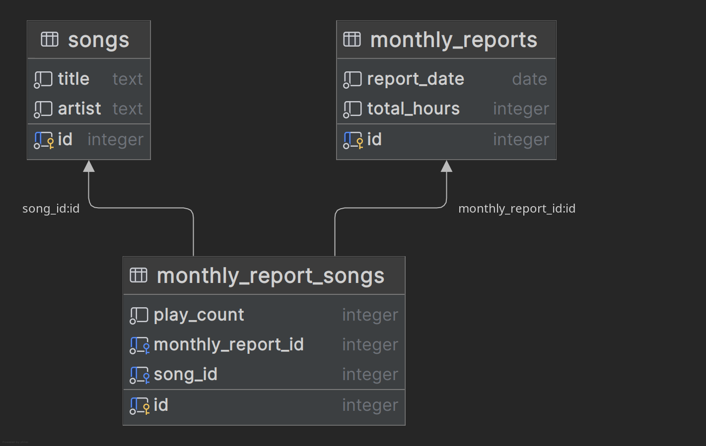

# Music Rankings

A personal fullstack web application for tracking and ranking the songs I 
listen to each month.
Built to replace my older Java Swing desktop app, and migrated into a 
modern decoupled fullstack architecture with a proper relational database.






## Tech Stack
- Frontend: React + Vite (JavaScript)
- Backend: .NET 10 Web API (C#)
- Database: PostgreSQL

**Frontend dependencies:** Tailwind CSS, Inter font (Fontsource), Recharts  
**Backend dependencies:** Entity Framework Core, Npgsql, EFCore.NamingConventions, OpenAPI

## Features
- Input monthly listening reports (song titles, artists, play counts)
- View song rankings filtered by month, year, or all-time
- Rankings sorted by play count
- Visualize monthly listening hours over time as a line chart

## Background
I use Musicolet as my music player on my phone. Every end of the month it 
generates a summary of my top 10 most-played songs, including song titles, 
artists, play counts, total listening hours, and the month and year.

In May 2025, I built a Java Swing desktop app to manually encode and track 
these records using JSON files through Gson.

A year later in May 2026, I rebuilt the entire project as a modern fullstack 
web application, properly separating the frontend and backend, and 
transitioning from flat JSON files into a normalized relational database 
using PostgreSQL.

## What I Learned
Developing this project helped me strengthen my understanding of modern web 
development:

- **JavaScript fundamentals** — especially callback functions and 
  asynchronous behavior
- **Core React concepts** — props, useState, useEffect, event handling, 
  and conditional rendering
- **Clean backend architecture** — implementing a Controller-Service pattern 
  and keeping entity classes anemic using Entity Framework Core as the ORM
- **LINQ** — and how powerful it is paired with EF Core for handling 
  aggregate queries in the service layer
- **Relational database design** — building a normalized PostgreSQL schema 
  with a junction table for many-to-many relationships
- **Data visualization** — creating a meaningful line chart using Recharts

## API Endpoints
| Method | Endpoint                    | Description                                 |
|--------|-----------------------------|---------------------------------------------|
| POST   | /api/songs                  | Submit a monthly listening report           |
| GET    | /api/songs                  | Get all songs                               |
| GET    | /api/songs/overall          | Get all-time top 40 rankings                |
| GET    | /api/songs/{year}           | Get annual top 25 rankings                  |
| GET    | /api/songs/{year}/{month}   | Get rankings for a specific month           |
| GET    | /api/monthly-reports/{year} | Get monthly listening hours of a given year |

## Instructions

### Prerequisites
- Node.js
- .NET 10 SDK
- PostgreSQL

### 1. Set up the database
```bash
sudo -u postgres psql
```
```sql
CREATE USER your_username WITH PASSWORD 'your_password';
CREATE DATABASE your_database OWNER your_username;
```

### 2. Clone the repository
```bash
git clone https://github.com/ravendr17/music-rankings.git
cd MusicRankings
```

### 3. Set up and run the frontend
```bash
cd music-rankings-ui
cp .env.example .env
npm install
npm run dev
```

### 4. Set up and run the backend
```bash
cd MusicRankingsAPI
cp appsettings.json appsettings.Development.json
# Open appsettings.Development.json and update DefaultConnection 
# with your PostgreSQL credentials
dotnet restore
dotnet run
```
The frontend runs on `http://localhost:5173`  
The API runs on `http://localhost:5150`

## Notes
- This project was primarily built for my personal use and learning purposes
- The frontend and backend are completely decoupled
- The backend follows a Controller-Service architecture using EF Core
- PostgreSQL is used as the relational database